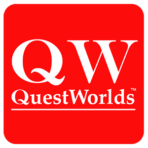
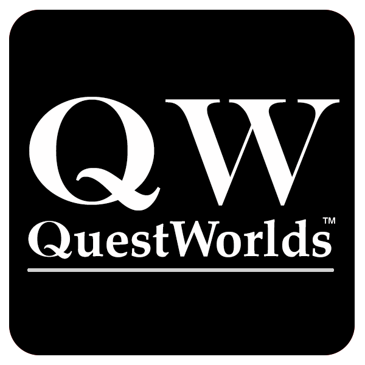

# 0.1 Legal Information

The *QuestWorlds* System Reference Document 0.97 (“QWSRD0.97”) describes the rules of *QuestWorlds*. You may incorporate the rules as they appear in QWSRD0.97, wholly or in part, into a derivative work, through the use of the ORC License. You should read and understand the terms of that License before creating a derivative work from QWSRD0.97.

### 0.1.1 Using This License

You should note that this is version of 0.97 of the *QuestWorlds* System Reference Document. We expect to release revised versions of this SRD, especially after development of Chaosium’s upcoming *QuestWorlds Core Book*. When we release the *QuestWorlds Core Book* we will update the version designation to 1.0, indicating that the SRD reflects the text published in that book. If you are developing materials for *QuestWorlds* projects you may want to bear this in mind. We will track any changes to the SRD at *https://github.com/ChaosiumInc/QuestWorlds*.

Once we release SRD version 1.0 we expect that to be stable for some time.

If you have questions about this license, please reach out to Moon Design at licensing@chaosium.com.

### 0.1.2 *QuestWorlds* ORC License Statement

This product is licensed under the ORC License held in the Library of Congress at TX 9-307-067 and available online at various locations including www.chaosium.com/orclicense, www.azoralaw.com/orclicense, and others. All warranties are disclaimed as set forth therein.

This product is the original work of Moon Design Publications.

If you use our ORC Content, please also credit us as follows:

QuestWorlds © copyright 2019–2023 Moon Design Publications LLC

Along with our logo

{ width=1inch height=1inch} { width=1inch height=1inch}

Reserved Material elements in this product include but may not be limited to all artwork, illustrations, and graphic design, and trade dress, and all trademarks, including *Call of Cthulhu*, *Chaosium*, *Future-World*, *Magic World*, *Pendragon*, *RuneQuest*,
*Superworld*, and *Worlds of Wonder*, and all other elements designated as Reserved Material under the ORC license.

QuestWorlds SRD with annotations for individual contributions can be found at GitHub: https://github.com/ChaosiumInc/QuestWorlds/

